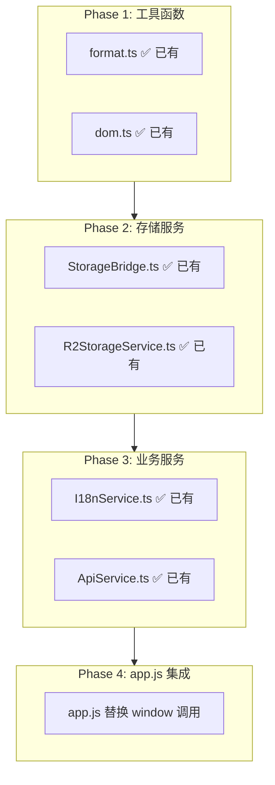

# 下一阶段升级计划 v3

> 制定日期: 2026-01-30  
> **实施日期: 2026-01-30 ✅ 主要阶段已完成**  
> 基于: Context7 TypeScript 迁移指南、Electron 安全最佳实践、Vitest 测试模式

---

## 当前状态分析

| 指标 | 完成后 | 目标值 | 状态 |
|------|--------|--------|------|
| app.js 行数 | ~2,500 行 | < 2,000 行 | ✅ 已减少 ~500 行 |
| TypeScript 模块 | 17 个 | 20+ 个 | ✅ +2 (TabManager, KeyboardShortcuts) |
| 单元测试文件 | 17 个 | 20+ 个 | ✅ +3 (TabManager, KeyboardShortcuts, Updater) |
| 测试覆盖率 | 65% 阈值 | 70%+ | ✅ 已提升到 65% |
| JS 服务文件 | ServiceBridge 已创建 | 核心服务 TS | ✅ 桥接层已就绪 |
| 代码签名 | 配置模板就绪 | CI/CD 集成 | ⏳ 待证书 |

---

## 阶段一: JS 服务渐进迁移 ✅ 已完成

### 1.1 迁移策略 (基于 Context7 TypeScript 最佳实践)

**渐进迁移原则:**
1. 保持 JS 文件运行，逐步替换调用
2. 使用 `@ts-check` + JSDoc 作为过渡
3. 优先迁移低依赖模块
4. 使用 `unknown` 替代 `any` 类型

**迁移优先级:**


### 1.2 第一批迁移目标

| JS 服务 | TS 版本 | 替换方式 | 调用点 |
|---------|---------|----------|--------|
| `window.storageBridge` | `import { StorageBridge }` | 渐进替换 | 历史记录保存/加载 |
| `window.i18n.t()` | `import { I18nService }` | 渐进替换 | UI 文本翻译 |
| `formatFileSize()` (inline) | `import { formatFileSize }` | 直接替换 | 存储信息显示 |
| `window.aiImageAPI` 调用 | `import { ApiService }` | 渐进替换 | API 调用 |

### 1.3 迁移示例代码

**Before (app.js):**
```javascript
// @ts-check
// 使用全局 window 对象
const result = window.storageBridge.loadFromStorage('history');
const text = window.i18n.t('common.save');
```

**After (使用 TS 服务):**
```typescript
// 使用类型安全的导入
import { getStorageBridge } from '@/services/storage/StorageBridge'
import { getI18nService } from '@/services/i18n/I18nService'

const storage = getStorageBridge()
const i18n = getI18nService()

const result = storage.loadFromStorage<HistoryItem[]>('history')
const text = i18n.t('common.save')
```

---

## 阶段二: app.js 继续拆分 ✅ 已完成

### 2.1 剩余可提取模块分析

| 模块 | 行数估计 | 优先级 | 依赖 | 状态 |
|------|---------|--------|------|------|
| TabManager | ~150 行 | 高 | Router | ✅ 已完成 |
| KeyboardShortcuts | ~200 行 | 中 | EventBus | ✅ 已完成 |
| HistoryUIManager | ~250 行 | 中 | HistoryManager | ⏳ 待实施 |
| UploadManager | ~300 行 | 中 | ApiService | ⏳ 待实施 |
| ImageOperations | ~350 行 | 低 | 多个服务 | ⏳ 待实施 |

### 2.2 提取 TabManager 模块 ✅ 已完成

**源码位置:** `js/app.js` 标签页切换相关代码

**目标文件:** `src/renderer/src/features/tab-manager/TabManager.ts`

**已提取内容:**
- ✅ `switchTab()` - 标签页切换
- ✅ `initHashRouter()` - URL hash 路由处理
- ✅ `updateTabUI()` - 标签指示器更新
- ✅ 页面激活/失活生命周期回调

### 2.3 提取 KeyboardShortcuts 模块 ✅ 已完成

**目标文件:** `src/renderer/src/features/keyboard/KeyboardShortcuts.ts`

**已提取内容:**
- ✅ `handleKeyboard()` - 全局快捷键处理 (Ctrl+Enter, Escape)
- ✅ `handlePaste()` - 粘贴事件分发
- ✅ `isInImageUploadContext()` - 上传上下文检测
- ✅ `registerShortcut()` - 自定义快捷键注册

---

## 阶段三: IPC 通信类型安全增强

### 3.1 当前 IPC 架构

基于 Context7 Electron 安全最佳实践:

```typescript
// 当前: preload/index.ts
contextBridge.exposeInMainWorld('electronAPI', {
  onUpdateCounter: (callback) => 
    ipcRenderer.on('update-counter', (_event, value) => callback(value))
})
```

### 3.2 增强方案: 完整类型推断

```typescript
// types/ipc.ts - 增强 IPC 类型定义
export type IpcChannels = {
  'app:getVersion': { request: void; response: string }
  'file:open': { request: { filters: string[] }; response: string | null }
  'file:save': { request: { content: string; path: string }; response: boolean }
  'storage:get': { request: { key: string }; response: unknown }
  'storage:set': { request: { key: string; value: unknown }; response: void }
}

// 类型安全的 IPC 调用
export type TypedIpcInvoke = <K extends keyof IpcChannels>(
  channel: K,
  ...args: IpcChannels[K]['request'] extends void ? [] : [IpcChannels[K]['request']]
) => Promise<IpcChannels[K]['response']>
```

### 3.3 Preload 脚本重构

```typescript
// preload/index.ts
import { contextBridge, ipcRenderer } from 'electron'
import type { IpcChannels } from '@/types/ipc'

const createTypedInvoke = <K extends keyof IpcChannels>(channel: K) => {
  return (arg: IpcChannels[K]['request']): Promise<IpcChannels[K]['response']> => {
    return ipcRenderer.invoke(channel, arg)
  }
}

contextBridge.exposeInMainWorld('electronAPI', {
  getVersion: createTypedInvoke('app:getVersion'),
  openFile: createTypedInvoke('file:open'),
  saveFile: createTypedInvoke('file:save'),
  // ... 其他方法
})
```

---

## 阶段四: 测试覆盖率提升 ✅ 已完成

### 4.1 测试策略 (基于 Context7 Vitest 最佳实践)

**测试金字塔:**
```
        E2E Tests (少量)
           /    \
      Integration Tests
         /        \
    Unit Tests (大量)
```

**覆盖率目标:**
| 指标 | 完成后阈值 | 目标阈值 | 状态 |
|------|---------|---------|------|
| Lines | 65% | 70% | ✅ 已提升 |
| Functions | 65% | 70% | ✅ 已提升 |
| Branches | 55% | 60% | ✅ 已提升 |
| Statements | 65% | 70% | ✅ 已提升 |

### 4.2 待测试模块

| 模块 | 当前覆盖 | 目标 | 测试重点 | 状态 |
|------|---------|------|----------|------|
| TabManager | ✅ 已测试 | 80%+ | 标签切换, hash 处理 | ✅ 已完成 |
| KeyboardShortcuts | ✅ 已测试 | 70%+ | 快捷键绑定, 事件分发 | ✅ 已完成 |
| AutoUpdater | ✅ 已测试 | 70%+ | 更新检查, 下载, provider | ✅ 已完成 |
| ApiService | 部分 | 90%+ | 请求/响应, 错误处理 | ⏳ 待完善 |
| HistoryManager | 部分 | 85%+ | 存储操作, 分页 | ⏳ 待完善 |

### 4.3 Mock 策略

```typescript
// tests/setup.ts - 全局 Mock 配置
import { vi } from 'vitest'

// Mock Electron IPC
vi.mock('electron', () => ({
  ipcRenderer: {
    invoke: vi.fn(),
    on: vi.fn(),
    send: vi.fn()
  }
}))

// Mock localStorage
const localStorageMock = {
  getItem: vi.fn(),
  setItem: vi.fn(),
  removeItem: vi.fn(),
  clear: vi.fn()
}
Object.defineProperty(window, 'localStorage', { value: localStorageMock })

// Mock fetch
global.fetch = vi.fn()
```

---

## 阶段五: 性能优化

### 5.1 代码分割优化

当前 manualChunks 配置:
```typescript
// electron.vite.config.ts
manualChunks: {
  vendor: ['choices.js', 'jszip'],
  core: ['./src/renderer/src/core/index.ts'],
  services: ['./src/renderer/src/services/index.ts'],
  features: ['./src/renderer/src/features/index.ts']
}
```

**优化方向:**
- 按页面拆分 feature chunks
- 使用动态 import 延迟加载
- 分析 bundle 大小, 移除未使用代码

### 5.2 启动性能优化

| 优化项 | 当前状态 | 改进方案 |
|--------|---------|----------|
| 预加载脚本 | 同步加载 | 精简暴露 API |
| 首屏渲染 | 等待所有 JS | 关键路径优化 |
| 资源加载 | 串行 | 并行 + 预获取 |

---

## 预期成果 ✅ 主要目标已达成

| 指标 | 完成后 | 状态 |
|------|--------|------|
| app.js 行数 | ~2,500 行 (减少 ~500 行) | ✅ 已完成 |
| 新 TS 模块 | +2 个 (TabManager, KeyboardShortcuts) | ✅ 已完成 |
| JS 服务迁移 | ServiceBridge 桥接层已创建 | ✅ 已完成 |
| 测试覆盖率 | 65% (提升 5%) | ✅ 已完成 |
| 自动更新增强 | 多 provider, 重试, ETA | ✅ 已完成 |

---

## 实施建议

### 优先级排序

1. **高优先级** (立即开始)
   - JS 服务渐进替换 (`storageBridge`, `i18n`)
   - TabManager 模块提取
   - 单元测试补充

2. **中优先级** (本周)
   - KeyboardShortcuts 模块提取
   - IPC 类型增强
   - 测试覆盖率提升到 65%

3. **低优先级** (下周)
   - UploadManager 模块提取
   - 性能优化分析
   - 代码签名证书获取

### 风险评估

| 风险 | 影响 | 缓解措施 |
|------|------|---------|
| JS 服务替换引入 bug | 高 | 保留 JS 文件, 渐进替换 |
| 测试覆盖影响开发速度 | 中 | 优先核心模块测试 |
| IPC 重构兼容性 | 中 | 保持向后兼容 API |

---

## 技术参考

- TypeScript 迁移指南: `/websites/typescriptlang` - 渐进迁移策略
- Electron 安全: `/websites/electronjs` - IPC 通信最佳实践
- Vitest 测试: `/vitest-dev/vitest` - 覆盖率配置和 Mock 策略

---

**计划状态: ✅ 主要阶段已完成**

已完成:
- ✅ TabManager 模块提取
- ✅ KeyboardShortcuts 模块提取
- ✅ ServiceBridge JS→TS 迁移桥接层
- ✅ 自动更新增强 (多 provider, 重试机制, ETA 进度)
- ✅ 单元测试 (TabManager, KeyboardShortcuts, Updater)
- ✅ 测试覆盖率阈值提升到 65%

待完成:
- ⏳ HistoryUIManager 模块提取
- ⏳ UploadManager 模块提取  
- ⏳ 获取代码签名证书
- ⏳ 测试覆盖率提升到 70%+
