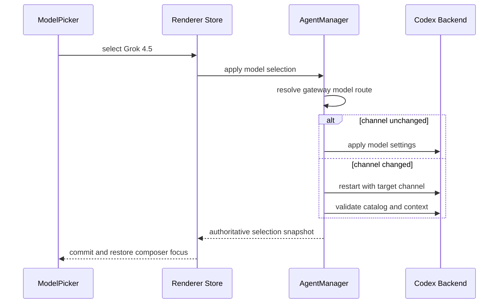

# 网关与模型统一路由设计

## 背景

Agent 设置页目前把 `apiyi`、`apiyi-grok`、`rightcode`、`rightcode-grok`
显示成四个 Provider。Grok 变体与父 Provider 共用 API Key，但为了选择不同
Responses endpoint，被建模成独立的用户可见 Provider。

这个模型把两类决策混在一起：

- 用户在设置页选择网关并管理凭证；
- 用户在聊天输入区选择本回合模型。

用户因此必须先在设置页切换 Grok Provider，再到聊天区确认模型。Right.Codes
还存在 `/codex/v1` 与 `/grok/v1` 的真实路由差异，所以只隐藏两张卡片会把
Grok 请求发到错误 endpoint，不能解决根因。

## 目标

- 设置页只展示 API Yi、Right.Codes 两个网关，每个网关只管理一份 Key。
- 当前网关可用的 GPT 与 Grok 模型统一出现在 Agent Chat 的 ModelPicker。
- 选择模型时自动解析并切换内部 Responses 通道。
- 跨通道切换有轻量反馈，不要求用户理解 endpoint。
- 通道切换、模型、上下文和持久化状态作为一个事务提交或回滚。
- 保留现有自定义 Provider、Responses 兼容代理和 Provider 级能力差异。
- 无损迁移已选择 Grok Provider 的现有用户状态。

## 非目标

- 不把不同网关的模型混入同一个 ModelPicker。
- 不允许用户手工选择内部 endpoint。
- 不改变自定义 Provider 的单通道配置表单。
- 不新增每次切换都出现的确认弹窗。
- 不在本次设计中扩展新的模型供应商。

## 用户心智模型

> 网关管凭证，模型选择器管能力，通道由应用自动路由。

设置页中的 Provider 改称“Codex 网关”。用户只需完成两项操作：

1. 选择 API Yi 或 Right.Codes；
2. 保存并测试该网关的 API Key。

进入 Agent Chat 后，ModelPicker 展示该网关支持的全部模型。选择 Grok 4.5
时，应用自动切换到网关的 Grok Responses 通道；选择 GPT 时自动回到标准
通道。

## 方案选择

采用方案 A：Gateway-first + 模型家族分组。

- 设置页只保留两个 Gateway 卡片。
- ModelPicker 顶部显示当前 Gateway。
- 模型按 `OPENAI`、`XAI` 分组，但保持一个搜索和键盘导航序列。
- 跨通道切换通过 ModelPicker 内联状态反馈。

未采用的方案：

- 单一扁平模型列表扫描最快，但弱化了 GPT 与 Grok 的能力边界。
- 模型家族 Tabs 对未来扩展友好，但当前模型数量不足以抵消额外层级。

## 领域模型

### Gateway

Gateway 是用户可见、可持久化选择的凭证边界。

```ts
interface GatewayPreset {
  id: 'apiyi' | 'rightcode'
  name: string
  credentialId: string
  defaultChannelId: string
  channelIds: string[]
}
```

内置 Gateway：

- `apiyi`
- `rightcode`

### Channel

Channel 是主进程内部的运行路由，不出现在设置页。

```ts
interface ProviderChannelPreset {
  id: string
  gatewayId: string
  baseUrl: string
  wireApi: 'responses'
  allowedModels?: string[]
  compatibilityPolicy?: string
}
```

内置 Channel：

- `apiyi-standard`
- `apiyi-grok`
- `rightcode-standard`
- `rightcode-grok`

现有 Grok Provider 的启动参数、endpoint、模型白名单和兼容代理配置迁移到
对应 Channel，不删除其运行能力。

### Model route

每个聚合模型条目包含内部路由信息：

```ts
interface AgentModelRoute {
  gatewayId: string
  channelId: string
  modelId: string
  family: 'openai' | 'xai' | 'other'
}
```

路由由主进程单一真源函数解析：

```ts
resolveGatewayModelRoute(gatewayId, modelId): AgentModelRoute
```

模型目录、模型选择事务和发送回合都调用该函数。渲染层不根据模型名称拼接
Channel ID 或 URL。

## 模型目录

`AgentManager` 为当前 Gateway 返回聚合目录：

1. 获取标准 Channel 的动态模型目录；
2. 合并 Gateway 下其他 Channel 的声明模型；
3. 按模型 ID 去重；
4. 注入 Channel、家族、上下文和推理能力；
5. 返回一个 Gateway 级 catalog revision。

Grok 4.5 的能力保持 Gateway 级差异：

- API Yi：500K 上下文；
- Right.Codes：1M 上下文；
- 两者支持 Low、Medium、High reasoning。

能力策略从“用户可见 Provider ID”迁移为“Gateway + Channel + Model”解析，
避免 UI 合并后丢失真实运行差异。

## 模型切换事务

新增主进程模型选择操作，渲染层只在成功响应后提交选中状态。



事务开始前保存：

- 当前 Gateway；
- 当前 Channel；
- 当前模型；
- 当前上下文设置；
- 当前 catalog revision。

事务成功时统一提交新快照。任一步失败时恢复旧 Channel 和模型，并重新加载旧
能力目录。切换期间禁用 ModelPicker、上下文和发送按钮。

同一 Channel 内的模型切换不重启 Codex。

## 发送前一致性

发送回合时，`AgentManager` 使用当前 Gateway 和模型重新解析权威路由：

- 当前 Backend 已在目标 Channel 时直接发送；
- Backend 与目标 Channel 不一致时先执行同一模型选择事务；
- 无法完成路由时不创建用户回合，并返回可重试错误。

选择阶段负责预热体验，发送阶段负责最终正确性。两条路径复用同一个事务，
不维护两套切换实现。

## 设置页

### Gateway 卡片

设置页只显示两个内置卡片：

- API Yi
- Right.Codes

卡片显示：

- Active / Ready / Needs key 状态；
- GPT、Grok 4.5 能力摘要；
- 该网关的最大上下文摘要。

不显示内部 Channel 名称或 endpoint。

### 凭证区

卡片下方只显示当前 Gateway 的一份 Key：

- 保存继续使用现有 `credentialId`；
- “测试并保存”验证凭证并刷新能力；
- 切换 Gateway 不复制或清空另一个 Gateway 的 Key。

自定义 Provider 继续显示为独立卡片并使用现有编辑表单。

## ModelPicker

### 布局

- 顶部保留搜索框；
- 搜索框下显示当前 Gateway；
- 模型按 `OPENAI`、`XAI` 分组；
- 模型行显示名称、模型 ID、上下文和最高 reasoning；
- 所有分组共享一个扁平键盘高亮索引。

### 跨通道反馈

选择跨 Channel 模型时：

1. 选中行进入 pending；
2. 面板内其他模型暂时禁用；
3. 底部显示“正在切换 Grok 通道…”；
4. 成功后关闭面板并把焦点还给输入框；
5. 失败后保持面板打开，显示原因和“重试”。

不使用全屏遮罩或确认弹窗。

### 不可用状态

- 未配置 Key：模型入口引导用户前往设置页。
- 确定性权限错误：模型保持可见但禁用，标记“当前 Key 未开通”。
- 429、超时、网络中断：模型保持可选，显示瞬态错误与重试。
- Provider 切换、上下文重启或 Agent 运行中：沿用现有统一禁用状态。

## 状态持久化与迁移

旧 Provider ID 按以下规则迁移：

```text
apiyi-grok     -> gateway: apiyi,     model: grok-4.5
rightcode-grok -> gateway: rightcode, model: grok-4.5
```

迁移保留：

- 共享 API Key；
- 已选模型；
- 模型级 reasoning；
- 模型级上下文；
- 当前线程的模型选择。

持久化结构不再保存内置 Grok Channel 为用户选中的 Provider。Channel 由
Gateway 和模型在运行时解析。

## 自定义 Provider

自定义 Provider 继续映射为单 Gateway、单 Channel：

- 设置页行为不变；
- 模型目录不强制分组；
- 不要求用户新增 Channel 配置；
- 现有 Provider 编辑 IPC 和持久化格式保持兼容。

未来如需开放自定义多 Channel Gateway，应另行设计，不在本次范围内。

## Responses 兼容代理

Responses 兼容代理绑定 Channel，而不是用户可见 Gateway：

- API Yi Grok Channel 保留 namespace tool 双向转换；
- `web_search` 非标准字段清理继续生效；
- 流式 UTF-8 安全转换继续生效；
- Right.Codes Channel 可继续使用同一通用边界，不改变其已验证兼容性。

## 可访问性

- Gateway 卡片使用可键盘操作的单选语义。
- ModelPicker 分组不打断上下键导航。
- Enter 应用模型，Esc 关闭面板。
- 切换状态使用 `aria-live="polite"`。
- 失败后焦点移动到内联错误区，重试成功后返回输入框。
- pending、disabled 和 unavailable 不只依赖颜色表达。
- 动效尊重 `prefers-reduced-motion`。

## 错误处理

错误按语义分为三类：

- 配置错误：Key 缺失、确定性未授权、模型未开通；
- 瞬态错误：429、网络中断、超时；
- 事务错误：Backend 重启或能力刷新失败。

配置错误提供设置入口；瞬态错误提供原位重试；事务错误执行完整回滚。错误信息
不暴露 API Key、token 或完整上游响应体。

## 测试策略

### 主进程

- Gateway 与 Channel 路由解析；
- Gateway 聚合模型目录与模型去重；
- API Yi 500K、Right.Codes 1M 能力策略；
- 同 Channel 切换不重启；
- 跨 Channel 切换成功；
- 切换失败完整回滚；
- 快速连续选择只提交最后一个有效事务；
- 发送前自动修复 stale Channel；
- Responses 兼容代理按 Channel 启动。

### 持久化与 IPC

- 两个 Grok 旧 Provider ID 无损迁移；
- 父 Gateway 与 Grok Channel 共享 Key；
- 模型选择 RPC 返回权威快照；
- Provider、模型和上下文事务失败时状态一致。

### 渲染层

- 设置页只显示两个内置 Gateway 卡片；
- 自定义 Provider 仍可创建、更新和删除；
- ModelPicker 按家族分组并共享键盘索引；
- pending、成功、失败、重试和 unavailable 状态；
- 成功与失败后的焦点恢复；
- 动态状态的 ARIA 宣告。

### 真实冒烟

- API Yi：GPT 与 Grok 4.5 各完成一个 Codex Responses 回合；
- Right.Codes：GPT 与 Grok 4.5 各完成一个 Codex Responses 回合；
- 429 只判定为瞬态错误；
- 两个网关切换后模型目录和上下文策略正确刷新。

## 验收标准

- 设置页不再出现 API Yi Grok、Right.Codes Grok 独立卡片。
- 同一 Gateway 只需保存一次 Key。
- Grok 4.5 可直接在 Agent Chat ModelPicker 中选择。
- Right.Codes Grok 请求始终发送到 `/grok/v1`。
- 跨 Channel 切换有轻量状态反馈，失败能恢复旧模型并重试。
- 旧用户升级后无需重新输入 Key 或重新配置模型偏好。
- 自定义 Provider 与现有 GPT 模型流程无回归。
