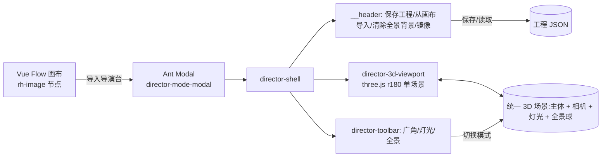

# 导演台模式(Director Stage)逆向研究报告

> 目标:**完全复刻**参考应用(Tapnow / Vue 版)中的「导演台」3D 编排模式,沉淀其架构、交互、数据模型,并对齐 GitHub 开源同类项目与本项目现状,给出可落地的实现方案。
>
> 基线:本项目已有 `ThreeGlobe`(广角/相机)、`ThreeLightScene`(灯光)、`PanoramaEditor`(全景)三个独立编辑器;导演台的本质是把三者**融合进同一个 3D 场景**,并补上「工程保存 / 从画布导入 / 全景背景 / 镜像」等舞台级能力。
>
> 技术栈:Three.js r180(与参考一致),遵循 `.agents/skills/three-best-practices`。

---

> ## ⚠️ 实测更正(2026-06 实机进入导演台后)
> 本报告 §1~§7 的早期结论部分基于 DOM 推断,**实机进入导演台后有重大更正**,以 **§8 实测界面拆解(地面真值)** 为准。三处关键纠偏:
> 1. **被摄主体不是"图片平面",而是可摆姿势的 3D 假人**(`普通假人` / `高级假人`),通过 TransformControls(移动/旋转/缩放)摆位,右侧「模型数据」面板显示位置/旋转/缩放 XYZ。
> 2. **从画布导入的图片是「全景球背景」**,不是主体;假人站在全景背景前。这解释了"导演台与全景模式绑定"。
> 3. **底部 `广角`/`灯光`/`全景` 不是三个编辑器 Tab**,而分别是:`广角`=镜头预设下拉、`灯光`=打光面板、`全景`=画幅比例下拉。真正的相机参数是左下角的 **FOV 滑杆 + 镜头距离 滑杆**,相机书签在右下「机位」。
>
> → 导演台本质 ≈ **「3D 假人摆姿 + 全景背景 + 相机/灯光编排」的 AI 出图垫场工具**(类 PoseMy.Art / Magic Poser + 背景合成)。

---

## 1. 逆向证据(观测到的 DOM / 运行时事实)

来自用户实测的 DOM 快照,逐条还原:

### 1.1 入口:画布图片节点的工具栏按钮
```
div.vue-flow__node-rh-image … > div.image-toolbar > button.glass-button.ce-toolbar-btn.toolbar-btn
  title="导入导演台"  aria-label="导入导演台"  →「导入导演台」
```
- 宿主是 **Vue Flow**(`vue-flow__*` 类名)无限画布,节点类型 `rh-image`(图片节点)。
- 每个图片节点的悬浮工具栏(`image-toolbar`)有一排玻璃拟态按钮(`glass-button`),其中第 8 个是「导入导演台」。
- 点击后:把**该节点的图片**作为"被摄主体"送入导演台模态框。

### 1.2 容器:Ant Design 模态框
```
div.ant-modal-root.cs-ti0311 > div.ant-modal-wrap.director-mode-modal
  > div.ant-modal > div.ant-modal-content > div.ant-modal-body
    > div.director-shell
```
- 用 **Ant Design Modal**(`ant-modal-*`)承载,自定义 wrap class `director-mode-modal`。
- 内部根容器 `director-shell`,分 `__header` / `__body` 两段。

### 1.3 顶部品牌栏(header / brand)
```
div.director-shell__header > div.director-shell__brand
  →「Director 导演台 | 保存工程 | 从画布导入 | 清除全景背景 | 镜像」
```
四个舞台级动作:
| 动作 | 推断语义 |
|---|---|
| **保存工程** | 把当前舞台状态(主体、相机、灯光、全景、镜像等)序列化为「工程」持久化(localStorage / 服务端) |
| **从画布导入** | 再次从 Vue Flow 画布拉取某个图片节点作为主体 / 全景源(不退出模态) |
| **清除全景背景** | 移除当前全景球贴图,回到纯色/网格舞台 |
| **镜像** | 主体或整个场景水平镜像(左右翻转) |

### 1.4 3D 视口
```
div.director-shell__body > div.director-3d-root > div.director-3d-viewport
  > canvas[data-engine="three.js r180"]  (772×548, touch-action:none)
```
- **Three.js r180** 单 `<canvas>`,占据 body 主区。
- `touch-action:none` → 自定义指针手势(与本项目 `ThreeGlobe`/`ThreeLightScene` 一致)。

### 1.5 底部工具栏(模式切换)
```
div.director-bottom-wrap.is-compact.is-mini > div.director-toolbar
  →「广角 | 灯光 | 全景」
```
- 三个**编辑模式 Tab**:`广角`(相机/焦段)、`灯光`、`全景`。
- `is-compact / is-mini` → 工具栏有尺寸态(随视口/窗口缩放)。

### 1.6 架构推断小结


**核心判断**:导演台是**一个共享的 Three.js 场景**(主体平面 + 相机 + 灯光 + 可选全景球),三个 Tab 只是**切换当前可交互的对象**(相机手柄 / 灯泡 / 全景视角)与对应面板,而非三个独立场景。这与本项目当前"三个独立 `<canvas>` 编辑器"是关键差异。

---

## 2. 与本项目现状的映射

本项目已有的能力几乎一一对应导演台的三个 Tab:

| 导演台 Tab | 本项目现有组件 | 复用要点 | 缺口 |
|---|---|---|---|
| **广角** | `ThreeGlobe.tsx` | 相机指示器绕主体环绕(`horizontal/vertical`)、`OrbitControls`、按需渲染 | 缺「焦段/FOV → 广角畸变」语义;当前是相机方位,不是镜头焦距 |
| **灯光** | `ThreeLightScene.tsx` | 灯泡拖拽(az/el)、体积光锥 shader、亮度/色温、相机/灯光解耦 | — |
| **全景** | `PanoramaEditor.tsx` | 全景球 + FOV + 透视曲度 + 截图/参考线/镜像 | 当前是独立查看器,需作为**舞台背景**叠加主体 |
| 共享 | `orbitGlobeShared.ts` | `ORBIT_RADIUS`、`addOrbitGlobe`、`disposeScene` | 需扩展为承载主体+灯光+相机+全景的统一场景 |

> 关键差异:参考的导演台把**主体、相机、灯光、全景**放进**同一场景同一相机**下实时预览(改灯光时能看到主体被照亮、切相机时全景背景跟着转)。本项目目前是三个相互独立、各自 dispose 的 `<canvas>`,无法互相影响。

---

## 3. 数据模型推断(工程 JSON Schema)

「保存工程」需要一份可序列化的舞台状态。基于观测 + 同类开源项目(Compose3D 的 `buildFiboJSON`、FiboStudio 的结构化参数),推断 schema:

```jsonc
{
  "version": 1,
  "subject": {
    "src": "cos://… 或 dataURL",   // 从画布导入的图片
    "mirror": false,                // 「镜像」开关
    "scale": 1,
    "aspect": 1.5
  },
  "camera": {                       // 「广角」Tab
    "azimuth": 45,                  // 水平环绕角(deg)
    "elevation": 20,                // 垂直俯仰角(deg)
    "fov": 50,                      // 焦段:广角(大FOV)↔ 长焦(小FOV)
    "distance": 17
  },
  "light": {                        // 「灯光」Tab
    "azimuth": 90,
    "elevation": 0,
    "brightness": 2.0,
    "color": "#ffffff",
    "preset": "front | left | …"
  },
  "panorama": {                     // 「全景」Tab
    "src": "cos://… | null",        // null = 「清除全景背景」
    "enabled": true,
    "yaw": 0, "pitch": 0,
    "fov": 75,
    "curvature": 1.0
  },
  "render": { "exposure": 1.0, "toneMapping": "AgX | None", "bloom": 0 },
  "meta": { "createdAt": 0, "updatedAt": 0, "sourceNodeId": "vue-flow node id" }
}
```

这份 JSON 同时是:① 工程持久化格式 ② **出图提示词合成的输入**(把相机/灯光/全景参数翻译成 `withRefPrefix` 风格的英文提示词,复用本项目 `prompts.ts`)。

---

## 4. 功能拆解与复刻方案

### 4.1 统一舞台场景 `DirectorStageScene`(核心)
新建一个组件,把三套对象建到**同一 `THREE.Scene` / 同一 `PerspectiveCamera`**:
- **主体**:`PlaneGeometry` + 贴图(沿用 `ThreeGlobe` 的纹理加载 + 镜像通过 `scale.x = -1` 或 UV 翻转实现)。
- **轨道球**:`addOrbitGlobe`(已有)。
- **相机指示器 + OrbitControls**:沿用 `ThreeGlobe` 的右键环绕 / 左键设角;`fov` 通过 `camera.fov` + `updateProjectionMatrix()` 实时改(广角畸变)。
- **灯光**:沿用 `ThreeLightScene` 的 `PointLight` + 体积光锥 shader + 可拖灯泡;**直接照亮主体平面**(主体材质需可受光 → 用 `MeshStandardMaterial`/`MeshBasicMaterial` 混合,或加环境光基底)。
- **全景球**:`SphereGeometry(BackSide)` 包裹整个场景作为背景;`清除全景背景` = 移除贴图回到 `0x1a1a1a`。

按 `three-best-practices`:**单 renderer、按需渲染(on-demand)**(`ThreeGlobe` 已示范 `invalidate()` 模式)、`OrbitControls` damping 时自我重绘、`disposeScene` 统一回收、`webglcontextlost/restored` 恢复(两组件已实现,直接抬进统一场景)。

### 4.2 模式 Tab(广角 / 灯光 / 全景)
- Tab 只切换**当前激活的交互对象**与右/下侧面板,场景常驻:
  - 广角:启用相机环绕手柄 + FOV 滑杆;
  - 灯光:启用灯泡拖拽 + 亮度/色温;
  - 全景:启用全景视角拖拽 + FOV/曲度。
- 复用本项目 `usePersistentState`(已建)做**参数持久化**,退出不丢。

### 4.3 顶部动作
| 动作 | 实现 |
|---|---|
| 保存工程 | 序列化 §3 schema → `localStorage`(命名空间 `director:project:v1`)或经 IPC 存盘;列表可后续加 |
| 从画布导入 | 复用现有「从画布导入参考图」桥接(`useVanillaPageRefImages` 同源思路),把选中节点图片塞进 `subject.src`(本项目可走 COS URL,见 `refImageUpload.ts`) |
| 清除全景背景 | `panorama.src = null` → 移除全景球贴图 |
| 镜像 | `subject.mirror` 切换 → `subject.scale.x *= -1`(注意贴图与提示词同步:镜像应在出图提示里声明 mirrored/flipped) |

### 4.4 出图链路
舞台 JSON → 提示词合成(扩展 `prompts.ts`:相机 az/el/fov → "wide-angle / telephoto, viewed from …";灯光 → "lit from …";全景 → "360° equirectangular background")→ 走现有 `ApiService` 生成。这正是 FiboStudio/Compose3D 的"场景即提示词"范式。

### 4.5 入口与承载
- 入口按钮「导演台」可挂到 `VisualPromptBar`(本项目已统一的视觉 prompt 工具栏)作为第 4 个能力,或图片结果网格的 hover 工具栏。
- 承载用本项目现有的 `ImageEditorModal`(portal 全屏覆盖)风格,新增 `editorType: 'director'` 分支,避免引入 Ant Design。

---

## 5. GitHub 开源参考(可直接借鉴)

| 项目 | 栈 | 与导演台的关系 | 可借鉴点 |
|---|---|---|---|
| **[habeebsl/compose3D](https://github.com/habeebsl/compose3D)** | Next + R3F + Three | 最接近:3D 编排 → 结构化 JSON → AI 出图 | `buildFiboJSON` 的**场景→提示词 schema**;GlobalPanel(灯光/相机/模板)面板组织;camera 预设视角 |
| **[SatyaPujith/FiboStudio](https://github.com/SatyaPujith/FiboStudio)** | R3F + drei + Gemini 3 | 专业「3D 产品摄影棚」 | key/fill/rim 三灯体系;相机角度/构图→结构化参数;"Studio Director" 语音指令(可选) |
| **[Dabble-Studio/3d-to-photo](https://github.com/Dabble-Studio/3d-to-photo)** | Three + SD inpainting | 虚拟摄影棚 / 垫图出图 | 主体放置 + 背景生成的 inpainting 思路;截屏喂模型 |
| **[aliyasser20/3-studio](https://github.com/aliyasser20/3-studio)** | R3F + Redux | GLB 查看/打光/截图/录像 | 截图&录像、主题色、灯光颜色面板;有 Electron 版可参考桌面端集成 |
| **[pmndrs/drei](https://docs.pmnd.rs/react-three-fiber)** | R3F 生态 | 舞台 helper 合集 | `<Stage>`/`<Environment>`/`<ContactShadows>`/`<OrbitControls>`/`<CameraControls>`——若未来迁 R3F 可省大量样板 |

> 选型建议:本项目当前是**命令式 vanilla three.js**(`ThreeGlobe`/`ThreeLightScene`),与导演台一致,**短期不必迁 R3F**;直接把三套对象合进一个命令式场景即可。Compose3D 的 **JSON schema** 与 FiboStudio 的**三灯/相机参数体系**是最值得直接搬的设计。若日后重构,drei 的 `<Stage>`/`<CameraControls>` 能大幅简化。

---

## 6. three-best-practices 对齐清单

复刻时必须遵守(参考 `.agents/skills/three-best-practices`):
- **单 WebGLRenderer**:统一场景只开一个 `<canvas>`,避免现状多编辑器多上下文(超过浏览器上限会丢失)。
- **按需渲染**:静态时不跑 RAF;`OrbitControls` damping / 灯光动画期间自我重绘(`ThreeGlobe.invalidate()` 已示范)。体积光锥需要持续动画时,仅在「灯光」Tab 激活时跑 RAF。
- **资源回收**:`disposeScene` + `geometry/material/texture.dispose()` + `renderer.forceContextLoss()`(两组件已落地)。
- **上下文丢失恢复**:`webglcontextlost/restored`(已落地,抬进统一场景)。
- **色彩管理**:贴图 `SRGBColorSpace`;ToneMapping 与 `PanoramaEditor` 对齐(默认 None / 可选 AgX),保证主体与全景背景观感一致。
- **DPR 上限**:`setPixelRatio(min(devicePixelRatio, 2))`,全屏舞台可按 `PanoramaEditor` 的有界超采样策略提清晰度。

---

## 7. 落地路线(分阶段)

1. **P0 — 统一场景骨架**:`DirectorStageScene`(主体 + 轨道球 + 相机 + OrbitControls + 按需渲染 + dispose/context-loss)。
2. **P1 — 灯光融合**:把 `ThreeLightScene` 的灯泡/光锥/拖拽抬进统一场景,主体可被照亮;灯光 Tab。
3. **P2 — 全景背景**:全景球作为背景叠加主体;广角 Tab 的 FOV 实时畸变;全景 Tab。
4. **P3 — 舞台动作**:从画布导入(COS URL)、镜像、清除全景背景。
5. **P4 — 工程持久化**:§3 schema 存/取(`usePersistentState` / IPC),工程列表。
6. **P5 — 出图链路**:舞台 JSON → `prompts.ts` 提示词合成 → `ApiService` 生成,闭环。

---

## 附:观测速查表

| 区域 | 选择器 | 内容 |
|---|---|---|
| 入口按钮 | `.image-toolbar > .toolbar-btn[title="导入导演台"]` | 导入导演台 |
| 模态 wrap | `.ant-modal-wrap.director-mode-modal` | Ant Modal |
| 根容器 | `.director-shell` | header + body |
| 品牌栏 | `.director-shell__brand` | 保存工程 / 从画布导入 / 清除全景背景 / 镜像 |
| 视口 | `.director-3d-viewport > canvas[data-engine="three.js r180"]` | 772×548 |
| 工具栏 | `.director-toolbar` | 广角 / 灯光 / 全景 |
| 工具栏态 | `.director-bottom-wrap.is-compact.is-mini` | 尺寸响应 |

---

## 8. 实测界面拆解(地面真值 · 2026-06 实机)

通过 agent-browser 登录 RunningHub → 在画布图片节点点击「导入导演台」→ 实机进入导演台,逐面板验证。以下为**确凿观测**,优先级高于 §1~§7 的推断。

### 8.1 整体布局(进入后默认态)
- **背景**:从画布导入的办公室图片被贴成 **360° 全景球**(equirectangular,`SphereGeometry` + `BackSide`),铺满整个视口。
- **主体**:场景中心有一个 **3D 假人模型** + 一个**蓝色占位 box**,身上挂着 **TransformControls 三轴 gizmo**(红=X / 绿=Y / 蓝=Z 平移箭头)。
- **中央竖线**:画幅/构图参考线。

### 8.2 顶栏(`director-shell__header`)
| 控件 | 类型 | 语义(实测) |
|---|---|---|
| `Director 导演台` | 品牌 | — |
| `保存工程` | 按钮 | 序列化整个舞台为工程 |
| `从画布导入` | 按钮 | 再次从 Vue Flow 画布拉图(作背景/主体源) |
| `清除全景背景` | 按钮 | 移除全景球贴图 |
| **`3D模式` ⇄ `2D模式`** | 分段切换 | **新增发现**:3D 编排 ↔ 2D 视图切换 |
| `镜像` | 按钮 | 水平翻转 |
| `×` | 关闭 | — |

### 8.3 左上(两个下拉)
- **`我的工程 ▾`**:工程选择/管理(对应「保存工程」的列表)。
- **`对象与机位 ▾`**:当前编辑模式选择器(对象 vs 机位)。

### 8.4 右侧「模型数据」面板(选中对象时)
绑定**当前选中 3D 对象**的变换,三组各 XYZ,每个轴 = `滑杆 + 数字输入 + ±1 步进按钮`:
| 分组 | 轴 | 默认值 | 映射 |
|---|---|---|---|
| **位置** | X/Y/Z | 0.00 | `object.position` |
| **旋转(°)** | X/Y/Z | 0 | `object.rotation`(度→弧度) |
| **缩放** | X/Y/Z | 1.00 | `object.scale`,带 **`锁定等比缩放`** 开关 |

> 步进按钮提示:"点击 ±1 步;按住上下拖动可快速调整;滚轮可微调"——即 spinbutton 支持 点击/拖拽/滚轮 三种输入。

### 8.5 底部工具栏(左→右)
| 控件 | 语义 |
|---|---|
| `添加模型` | 下拉:**`普通假人`** / **`高级假人`**(可摆姿势的 3D 人体模型) |
| `删除选中` | 删除当前对象 |
| **`移动` / `旋转` / `缩放`** | TransformControls 三种 gizmo 模式(translate/rotate/scale) |
| `广角` | **镜头预设**下拉(见 8.7) |
| `灯光` | **打光面板**(见 8.8) |
| `全景` | **画幅比例**下拉(见 8.9) |
| `更多` | 其他动作 |

### 8.6 左下角:相机直控(常驻)
- **`FOV` 滑杆**:实测 73.7(广角档)。直接驱动 `camera.fov` + `updateProjectionMatrix()`。
- **`镜头距离` 滑杆**:实测 4.0。相机沿视线到主体的距离(轨道半径)。

### 8.7 `广角` → 镜头预设(`镜头预设`下拉)
七档,选中即把 FOV 设为对应的 35mm 等效焦距:
`标准` / **`广角`✓** / `超广角` / `人像` / `长焦` / `超长焦` / `鱼眼`
> 即 焦段语义层(标准≈50mm、广角≈24-35mm、超广角≈16mm、人像≈85mm、长焦≈135mm、超长焦≈200mm+、鱼眼≈极大FOV),底层仍是同一个 `camera.fov`。

### 8.8 `灯光` → 打光面板(整体可开/关)
| 灯 | 类型 | 参数(实测) |
|---|---|---|
| **主光** | 平行光 `DirectionalLight` | `强度` 4.0 · `水平`(方位角)40° · `俯仰`(仰角)18° · `主光颜色` |
| **环境光** | 半球光 `HemisphereLight` | `强度` 0.60 · `环境光颜色` |
> 比本项目 `ThreeLightScene`(PointLight + 体积光锥)**更简**:方向光(可调方位/仰角/强度/色)+ 半球环境光(强度/色)。az/el 控制太阳方向。

### 8.9 `全景` → 画幅比例(`画幅比例`下拉)
九档:**`全景`✓** / `1:1` / `4:3` / `3:4` / `16:9` / `9:16` / `3:2` / `2:3` / `21:9`
> 决定**输出画幅 / 视口裁切框**。`全景` = 不裁(完整等距投影),其余为标准出图比例。

### 8.10 右下「机位」→ 相机书签系统
- `自由视角`(默认自由轨道)+ **`+ 机位`**(保存命名机位)。
- 每个机位 = 缩略图预览 + `FOV 74°` 标注 + **三分构图网格**叠加。
- 可保存多个机位,来回切换不同角度/焦段。

### 8.11 修正后的数据模型(替代 §3 推断)
```jsonc
{
  "version": 2,
  "mode": "3d",                          // 3D模式 / 2D模式
  "background": {                        // ← 从画布导入的图片其实是全景背景
    "src": "cos://… | null",             // null = 清除全景背景
    "type": "equirectangular",
    "mirror": false                      // 「镜像」
  },
  "objects": [                           // ← 主体是 3D 假人数组(可多个)
    {
      "id": "obj_1",
      "type": "dummy_basic | dummy_advanced",   // 普通假人 / 高级假人
      "transform": {
        "position": [0, 0, 0],
        "rotation": [0, 0, 0],           // 度
        "scale": [1, 1, 1],
        "uniformScale": true             // 锁定等比缩放
      },
      "pose": { "...": "高级假人的骨骼姿势(可选)" }
    }
  ],
  "camera": {
    "fov": 73.7,                         // FOV 滑杆
    "distance": 4.0,                     // 镜头距离 滑杆
    "lensPreset": "wide",                // 标准/广角/超广角/人像/长焦/超长焦/鱼眼
    "aspect": "panorama",                // 画幅比例:panorama/1:1/4:3/3:4/16:9/9:16/3:2/2:3/21:9
    "bookmarks": [                       // 机位
      { "name": "机位1", "azimuth": 0, "elevation": 0, "fov": 74, "target": [0,0,0] }
    ]
  },
  "light": {
    "enabled": true,
    "directional": { "intensity": 4.0, "azimuth": 40, "elevation": 18, "color": "#ffffff" },
    "hemisphere":  { "intensity": 0.60, "color": "#ffffff" }
  },
  "meta": { "sourceNodeId": "…", "createdAt": 0, "updatedAt": 0 }
}
```

### 8.12 复刻方案修订要点(对 §4 的补充)
1. **核心是 3D 假人,不是图片平面**:需引入可摆姿势的人体模型(`普通假人`=固定姿势 mesh;`高级假人`=带骨骼 rig 可调 pose)。出图时把假人渲成 **深度图 / OpenPose 骨架 / 法线图** 作为 ControlNet 条件,这才是导演台→AI 的真正控制通路。
2. **全景图作背景球**(已对应本项目 `PanoramaEditor`),主体假人叠在前面 → 统一场景。
3. **TransformControls** 用 three.js 官方 `TransformControls`(translate/rotate/scale 三模式)直接接「模型数据」面板双向绑定。
4. **相机层**:FOV 滑杆 + 镜头距离 + 镜头预设(FOV 预设表)+ 画幅比例(裁切框)+ 机位书签(保存 `{azimuth,elevation,distance,fov,target}`)。
5. **灯光层简化**:`DirectionalLight`(az/el/强度/色)+ `HemisphereLight`(强度/色),比现有 `ThreeLightScene` 轻量,优先这套。
6. **两个入口**(按用户要求):① 原生入口(左侧栏「导演台」按钮,空场景新建)② 全景导入入口(图片节点「导入导演台」,带背景图进入)。

### 8.13 开源对标修订
- 假人摆姿这一层,**[PoseMy.Art]**、**[Magic Poser]**、开源 **[three.js + mixamo rig]**、**[pmndrs/drei `<Stage>`]** 更贴近;假人→ControlNet 出图可参考 **ControlNet OpenPose / Depth** 工作流。
- 原 §5 的 Compose3D / FiboStudio 仍适用于"场景参数→提示词"层。

---

## 9. 海外站实测抓包(地面真值 v2 — 真实 API / 资源 / 认证)

> 来源:`https://rhtv.runninghub.ai/projects/canvas/2063349358432108546`(海外版,已登录抓包,HAR 531 请求 + 直连 API)。
> 三维引擎 canvas 标记 `data-engine="three.js r180"`,确认 **three.js r180**。

### 9.1 认证模型(复刻登录态必读)
- 登录态**主存于 localStorage**,不是只靠 cookie。关键键:
  - `Rh-Accesstoken`(JWT,HS512,payload 含 `sub`=userId、`exp`、`created`、`username`、`userRegion`)
  - `Rh-Refreshtoken`、`Rh-Identify`、`Rh-Expire-In`(=accesstoken `exp`×1000 毫秒)、`userId`、`Rh-first-login`
  - `userInfo`(JSON:`{id,mobile,email,nickName,headIcon,...}`)— SPA 用它判断 UI 登录态;为 null 时弹登录框
- 同名 cookie 也存在(`.runninghub.ai` 泛子域),但 **SPA 鉴权读 localStorage**,API 鉴权用请求头。
- **API 鉴权头**:`Authorization: Bearer <Rh-Accesstoken>`,附 `Content-Type: application/json`、`User-Language: zh_CN`。
- 复刻 / 自动化登录:注入上述 localStorage 键 + 同步 cookie 后,SPA 会自动用 token 拉取 `userInfo`。本仓已存登录态快照 `~/.agent-browser/rh-ai-auth.json`(`agent-browser state load` 可恢复)。

### 9.2 核心 API 契约
| 端点 | 方法 | 鉴权 | Body | 返回 |
|---|---|---|---|---|
| `/canvas/director/model/list` | POST | Bearer | `{}` | 模型目录(5 分类 / 99 模型) |
| `/canvas/director/project/list` | POST | Bearer | `{}` | 导演台工程列表(「我的工程」下拉) |

`model/list` 返回结构:
```jsonc
{ "code": 0, "msg": "success", "data": [
  { "key": "JC", "label": "基础模型", "description": "...",
    "models": [
      { "id": "c53956d2-…", "name": "女",
        "url": "https://rh-canvas-files.xiaoyaoyou.com/default/director/<uuid>.gltf",
        "previewImage": "https://rh-canvas-files.xiaoyaoyou.com/default/director/<uuid>.png" }
    ] }
] }
```

### 9.3 资源托管(CDN)
- 模型文件:`https://rh-canvas-files.xiaoyaoyou.com/default/director/<uuid>.gltf`(每个模型一个 GLTF)
- 缩略图:同目录 `<uuid>.png`,经腾讯云 `imageMogr2/thumbnail/256x256>/format/webp/rquality/70/...` 实时压缩
- **假人骨架 rig**:`https://rhtv.runninghub.ai/dummy/x_bot.fbx` —— 即 **Mixamo「X Bot」** 标准人形 rig(FBX,带骨骼)。"高级假人/姿势"系统就是基于它做骨骼摆姿(OpenPose 风格输出的来源)。

### 9.4 完整模型库(99 个,5 大分类)
完整目录已落盘:`docs/director-model-catalog.json`(干净 UTF-8,含每个模型 id/name/gltf/缩略图)。
| key | 分类 | 数量 | 代表模型 |
|---|---|---|---|
| `JC` | 基础模型 | 12 | 女、男、地形、管道、立方体、球体、斜坡、圆环体、圆柱体、圆锥体、平面、圆盘 |
| `RW` | 人物 | 32 | 建筑工人 01–05、警察(法警/特警)、消防员 01–03、医生 01–06、宇航员、职场男/女、各朝代盔甲(汉/秦/明/清/唐/元) |
| `DJ` | 道具 | 19 | (详见 JSON) |
| `CJ` | 场景 | 12 | (详见 JSON) |
| `JT` | 交通工具 | 24 | (详见 JSON) |

> 「普通假人 / 高级假人」底栏快捷按钮 = 基础模型里的 女/男(普通=静态网格)与 X Bot rig(高级=可摆姿);`选择模型` 弹窗另含 `我的模型` + `↑ 上传模型`(支持用户自传 GLTF/GLB)。

### 9.5 两个入口的实测差异(坐实用户判断)
| | 原生入口(左侧栏「导演台」) | 全景导入入口(图片节点「导入导演台」) |
|---|---|---|
| 背景 | **空网格地面**,无全景球 | 导入的图片作**全景背景** |
| 默认相机 | FOV ≈ 39.6 / 镜头距离 8.0(**标准镜头**) | FOV ≈ 73.7 / 距离 4.0(**广角**) |
| 头部按钮 | Director 导演台 / 保存工程 / 从画布导入 / **3D模式·2D模式** / × | 退出 / 截图 / 4视角截图 / 12视角截图 / 重置 / 镜像 / 参考线 / 16:9 / 全屏 / 导入导演台 / ↑替换 |

### 9.6 实测 UI 控件全集(底栏 + 右栏)
- **右栏双 Tab**:`属性`(变换:位移/旋转/缩放 XYZ,各带滑杆+步进器+锁定等比缩放) / `姿势`(骨骼摆姿,仅高级假人/rig)。
- **底栏**:`添加模型`▸(普通假人/高级假人/打开模型库) · `删除选中` · 变换 gizmo(`移动`/`旋转`/`缩放`) · `标准`(镜头预设) · `灯光` · `复位` · `网格` · `全景` · `1080p`(分辨率) · `截屏` · `录制视频` · `机位` · `快捷键`。
- **左下相机**:`FOV` 滑杆 + `镜头距离` 滑杆。
- **截图产出**:`截屏` / `4视角截图` / `12视角截图`(多视角批量) + `录制视频` —— 对应导出给后续 AI 生成的多条件图。

### 9.7 复刻落地补充(对 §8.12 的工程化收口)
1. **资源层**:本地建 `director/model/list` 等价接口 + 一份 `model-catalog.json`(直接复用 `docs/director-model-catalog.json` 结构:`[{key,label,models:[{id,name,url,previewImage}]}]`);GLTF 用 `GLTFLoader`,假人 rig 用 `FBXLoader` 加载 Mixamo X Bot,`SkeletonHelper` + `TransformControls`(或 IK)做摆姿。
2. **加载器**:three.js r180 + `GLTFLoader`/`FBXLoader`/`DRACOLoader`(按需)+ 缩略图懒加载(webp 256²)。
3. **鉴权**:复用本仓 `ApiService` 模式,统一加 `Authorization: Bearer` 拦截器;登录态读写与现有 `useBatchStore`/本地存储对齐。
4. **导出**:实现 `截屏 / 4视角 / 12视角 / 录制`,并把假人渲成 **Depth + OpenPose + Normal** 三件套(ControlNet 条件),才是导演台真正价值。
5. **入口**:原生(空网格)+ 全景导入(背景球)两套初始化参数(相机 FOV/距离差异见 §9.5)。

### 9.8 抓取物料清单(本次落盘)
- `docs/director-model-catalog.json` — 99 模型完整目录(权威)。
- `~/.agent-browser/rh-ai-auth.json` — 海外站登录态快照(私密,勿外传)。
- HAR:`~/.agent-browser/tmp/director-mannequin.har`(531 请求,含 `x_bot.fbx`、`model/list`、CDN gltf)。

---

## 10. 实测实现常量(地面真值 v3 — 镜头 / 灯光 / 变换数值表)

> 取值方式:海外站导演台实景,逐个驱动 UI 并读取 `<input type=range>` 真实 `value`(FOV 滑杆以唯一特征 `min=10/max=150` 锁定),非源码推断。可直接作为复刻常量。

### 10.1 镜头预设表(底栏「镜头预设」下拉,共 7 项)
点选预设即把相机 `fov` 设为下表值(FOV 滑杆范围 **10–150**):

| 预设 | `fov`(°,实测) | ≈ 全画幅水平等效焦距 | 备注 |
|---|---|---|---|
| 标准 | **39.6**(滑杆 39.5,默认勾选) | ~50mm | 原生入口默认 |
| 广角 | **73.5** | ~24mm | **全景导入入口默认** |
| 超广角 | **96.5** | ~16mm | |
| 人像 | **24.0** | ~85mm | |
| 长焦 | **15.0** | ~135mm | |
| 超长焦 | **10.5** | ~200mm | 接近 FOV 下限 |
| 鱼眼 | **150.0** | 鱼眼 | = FOV 上限 |

复刻:`camera.fov = preset; camera.updateProjectionMatrix()`。鱼眼若要真实畸变需后处理/自定义投影,这里只是把透视 FOV 拉到 150。

### 10.2 灯光默认值(底栏「灯光」面板)
| 参数 | 控件 | 默认值 | 滑杆范围 | 映射 |
|---|---|---|---|---|
| 主光 强度 | slider | **4.0** | 0–10 | `DirectionalLight.intensity` |
| 主光 水平(方位角) | slider | **61°** | 0–360 | 由方位角+俯仰角球面坐标算光源位置 |
| 主光 俯仰(仰角) | slider | **13**(面板显示 ~17°) | −90–90 | 同上 |
| 主光 颜色 | color | **#FFFFFF** | — | `DirectionalLight.color` |
| 环境光 强度 | slider | **0.60** | 0–3 | `HemisphereLight`(半球光).intensity |
| 环境光 颜色 | color | **#FFFFFF** | — | 半球光天顶色 |

光源位置换算(球面→笛卡尔,半径 R 取场景尺度):
```js
const az = THREE.MathUtils.degToRad(azimuthDeg);
const el = THREE.MathUtils.degToRad(elevationDeg);
dirLight.position.set(R*Math.cos(el)*Math.cos(az), R*Math.sin(el), R*Math.cos(el)*Math.sin(az));
```

### 10.3 相机与变换数值表(右栏「模型数据」+ 左下相机)
| 控件 | 默认 | 范围 | 绑定 |
|---|---|---|---|
| FOV | 39.6 | 10–150 | `camera.fov` |
| 镜头距离 | 2.7(原生入口文档值 8.0,实测当前 2.7 视模型而定) | 1–30 | `OrbitControls` 半径 / dolly |
| 位置 X/Y/Z | 0 / 0 / 0 | −50 – 50 | `object.position` |
| 旋转 X/Y/Z | 0 / 0 / 0 | −180 – 180(度) | `object.rotation`(度→弧度) |
| 缩放 X/Y/Z | 1.00 | 0.01 – 5 | `object.scale`,默认**锁定等比** |

### 10.4 工具栏 / 截图模式按钮全集(实测 accessibility 名)
- **底栏**:`添加模型`(▸ 普通假人 / 高级假人 / 模型库) · `删除选中` · `移动` · `旋转` · `缩放` · `[镜头预设]` · `灯光` · `复位` · `网格` · `全景` · `1080p` · `截屏` · `录制视频` · `机位` · `快捷键`。
- **全景/截图模式头栏**:`退出` · `截图` · `4视角截图` · `12视角截图` · `重置` · `镜像` · `参考线` · `16:9` · `全屏` · `导入导演台` · `↑替换`。
- **左侧 dock**:`资产` · `工作流` · `历史` · `导演台` · `剪辑`。

### 10.5 三大渲染器/控制器侧载结论
- `7TxFGle7.js`(~3MB 主包)含 `GLTFLoader` / `DirectionalLight` / `director/model/list` —— three.js 核心与 API 在主包。
- `DmCaBqUs.js` 等懒块承载 3D 视图组件;Nuxt 哈希命名 + 压缩,字符串考古不可行,故采用实景取值(本节)。
- `OrbitControls` + `TransformControls`(gizmo:移动/旋转/缩放)+ `GLTFLoader`(模型)+ `FBXLoader`(X Bot rig)为确定栈。

### 10.6 复刻骨架建议常量(可直接抄进 `DirectionStageScene`)
```ts
export const LENS_PRESETS = {
  标准: 39.6, 广角: 73.5, 超广角: 96.5, 人像: 24, 长焦: 15, 超长焦: 10.5, 鱼眼: 150,
} as const;
export const FOV_RANGE = [10, 150] as const;
export const LIGHT_DEFAULTS = {
  key:     { intensity: 4.0, azimuthDeg: 61, elevationDeg: 17, color: '#ffffff', range: { intensity: [0,10], azimuth: [0,360], elevation: [-90,90] } },
  ambient: { intensity: 0.6, color: '#ffffff', range: { intensity: [0,3] } },
} as const;
export const TRANSFORM_RANGE = {
  position: [-50, 50], rotationDeg: [-180, 180], scale: [0.01, 5],
} as const;
export const ENTRY_DEFAULTS = {
  native:   { fov: 39.6, distance: 8.0, background: 'grid' },
  panorama: { fov: 73.5, distance: 4.0, background: 'equirect-sphere' },
} as const;
```

---

## 11. 高级假人(骨骼系统)彻底逆向 —— 源自导演块 `Dmnzwia4.js`

> 本节是用户两张截图(红/蓝高级假人 + 35 姿态预设 + 骨骼调节)指向的「有骨骼」资源的最终落地。全部从实站导演块 `https://rhtv.runninghub.ai/_nuxt/Dmnzwia4.js`(~1MB)逆向取得。

### 11.1 对象分类(场景图 source/kind)
| source | mannequinKind | 中文 | 资源 |
|---|---|---|---|
| `mannequin` | `advanced` | **高级假人**(可摆姿) | Mixamo X/Y Bot 绑定 FBX |
| `mannequin` | `crowd` / `crowdArray` | **普通假人 / 路人**(底栏按钮) | 程序化关节小人(`ed`→`od`),无文件 |
| `primitive` | — | 基础几何体 | Box/Sphere/Cylinder/Cone |
| `humanoid` | — | 简模人形(内部 `addHumanoid`,非底栏按钮) | 球头+胶囊体(`Rt`) |
| `model` / `splat` | — | 导入模型 / 高斯泼溅 | — |

> 关键纠正:底栏「普通假人」按钮 = **crowd 路人系统**(`addCrowdMannequinLayout`),不是 `humanoid`(`Rt` 简模),也**不是模型目录里的 GLTF**。`humanoid` 是另一处内部资产。

### 11.2 红/蓝两套绑定(ground truth)
```js
dd = { x:"/dummy/x_bot.fbx", y:"/dummy/y_bot.fbx" }   // rig 文件
ud = { x:"X Bot", y:"Y Bot" }                          // 显示名
// 导出日志佐证:"y"===a ? "蓝色 Y Bot" : "红色 X Bot"
```
- **红色 = X Bot = `/dummy/x_bot.fbx`**(已下载 1.7MB)
- **蓝色 = Y Bot = `/dummy/y_bot.fbx`**(已下载 1.9MB)
- 落地:`director/rig/{x,y}_bot.fbx`,经 `rigUrl()` 用 `import.meta.url` 解析。

### 11.3 姿态预设(35 个静态姿势)
- 注册表:`Bs=[站立,背手站,坐姿,…,俯卧撑,爬行]`(35)+ `默认`(rest)= UI 36 项。
- 数据形态:每个姿势是 `JSON.parse('{ "骨盆": { boneName:"mixamorigHips", group:"躯干", forwardTilt/twist/sideTilt, rotationEuler{x,y,z}, quaternion{x,y,z,w}, position } , … }')`,即**烘焙好的 52 根骨骼本地四元数**(`sourceStaticFbx` 标注原始 FBX 末帧来源,如 `Animations/00_静态姿势预设/11_运动健身球类/俯卧撑.fbx`)。
- 运行时优先用 `./assets/bot-anims/{key}.fbx`,无则回退烘焙增量(`MIXAMO_BOT_BONE_PRESETS`)。本复刻**直接采用烘焙四元数**,免再下载动画 FBX。
- 提取产物:`director/bot-pose-presets.json` = `{ poseKey: { mixamorigBoneName:[qx,qy,qz,qw] } }`(35×52)。

### 11.4 骨骼分组 / 调节(姿势调节面板)
- 8 组:`躯干 / 头颈 / 左臂 / 右臂 / 左腿 / 右腿 / 手指 / 脚趾`,共 52 根。
- 每根:`{ label(中文), boneName(mixamorig…), group }`,产物 `director/bot-bone-schema.json`。
- 名称匹配 `wd()`:去 `mixamorig\d*[:_]?` / `armature` 前缀、去分隔符、小写 → 统一键。
- 调节滑杆 = 在「预设基准四元数」上叠加 XYZ 欧拉增量(`bone.q = base ⊗ Euler(dx,dy,dz)`)。

### 11.5 复刻落点(本仓)
- `DirectorStageScene`:新增 `applyPose(map|null)` / `setBoneDelta(boneName,deg)` / `isAdvancedMannequin()`;`storeRestPose` 标记 `isFbxBot` 并存 `_poseBase`;`normBone()/findByNorm()` 名称归一。
- `directorConstants`:`ADVANCED_MANNEQUIN`(red=X / blue=Y)+ `rigUrl()`。
- `directorPoses`:载入 35 预设 + 骨骼 schema/分组。
- `DirectorEditor`:底栏「高级假人 ▾」红/蓝弹窗 + 「添加X色假人」;姿势页「姿态预设」网格(36)+「姿势调节」分组滑杆(8 组,每骨 XYZ + 重置)。

### 11.6 普通假人(路人)阵列系统 —— `ed`/`od` + `addCrowdMannequinLayout`
- **关节小人 `od()`**(`ed` 以 `showControlBlock:false` 调用):`pelvisPivot → torsoPivot(胶囊躯干)→ neck/headPivot(球头+眼/鼻/嘴)`,四肢为 `shoulder/elbow + hip/knee` 关节组下的盒体段(`id()`)。`balanced` 体型:`torsoRadius .24 / torsoLength .82 / chestWidth=hipWidth .48 / limbWidth .12`;`neutral` 姿势(全关节角=0)。
- **材质调色 `td(color,mix,amt)`**:`body=色` / `accent=+白74%` / `trim=+白44%` / `limb=+#223142 34%` / `detail=+#101924 50%` / `soft=+白22%`,`roughness .55 / metalness .04`。
- **6 色路人盘**(循环上色):`#4f7a9d / #8c6a46 / #8a5f75 / #5c7a52 / #6f7d95 / #7a7252`。
- **三种布局 `addCrowdMannequinLayout`**:
  - `single`(直接添加):1 个,`rotationY=π`。
  - `array`(阵列):`count` 个铺 `columns` 列,`spacingX=1.35 / spacingZ=1.6`,行 `ceil(count/cols)`,居中偏移 `-(cols-1)·gx/2, -(rows-1)·gz/2`,位置 `round(·,0.1)`,名 `路人队列`。默认 `count 8 / cols 4`。
  - `random`(随机分布):`count` 个在半径 `radius=4.2` 圆盘内 `ang=rand·2π, r=√rand·radius`,随机朝向,名 `路人(随机)`。默认 `count 10`。
- **复刻落点**:`directorMannequin.ts`(`buildCrowdFigure`/`buildCrowdLayout` + `CROWD_COLORS`/`CROWD_DEFAULTS`);`DirectorStageScene.addCrowd(opts)`(落地后按包围盒贴地,不做高度归一);`DirectorEditor` 底栏「普通假人 ▾」弹窗:`直接添加 / 阵列 / 随机分布` 分段 + `数量/列数/横向间距/纵向间距/分布半径` 数值输入 + 「生成批量路人」。
- **无动作文件**:`bot-anims/*.fbx` 在部署版是空 glob(`Object.assign({})`),路人恒为 `neutral`,不带动画。

---

## 12. 机位系统 UI + 录制视频(实站可视化逆向 —— 登录后实拍)

> 本节来自登录实站(userId=1955726710136320002)进入「导演台」后逐屏实拍 + 无障碍快照。纠正了早期把「机位/录制」做成简化面板的偏差。

### 12.1 顶部 / 底栏结构(实拍 ground truth)
- 顶栏:`Director 导演台` · `保存工程` · `从画布导入` · 居中分段 **`3D模式 | 2D模式`** · 右上 `×`。
- 底栏(左→右):`FOV` 滑杆(默认 **39.6**)、`镜头距离` 滑杆(默认 **8.0**);`添加模型(+)`、`普通假人`、`高级假人`、`删除选中`、`移动/旋转/缩放`(未选中时禁用)、`标准`(镜头预设)、`灯光`、`复位`、`网格`、`全景`、`1080p`、`截屏`、`录制视频`;最右 `机位`、`快捷键`。
- 左上浮层:`我的工程 ▾`、`对象与机位 ①(计数) ▾`。

### 12.2 机位预览浮窗(图三 —— 点击「机位」打开,右下角)
- 头部标签条:**`自由视角` | `机位1` | `机位2` … | `+机位`(新增)**,右侧 `全屏`(⛶)、`关闭`(×)。
- 主体:**当前选中标签对应相机的实时预览缩略图**,左上角叠加 `FOV 40°` 文本。
- 多机位:每个 `机位N` 是一个独立标签,各自渲染该机位相机的缩略画面,可在多个机位间切换预览。
- 选中某个 `机位N` 标签 → 右侧弹出「属性」面板(见 12.3),并把主视图切到该机位。

### 12.3 机位属性面板(右侧「属性」)
| 字段 | 控件 | 默认/示例 |
|---|---|---|
| 名称 | textbox | `机位1` |
| 位置 | X/Y/Z spinbutton(各带 `±1 步;按住拖动快调;滚轮微调` 双步进按钮) | `2.10 / 1.38 / 7.67` |
| LookAt 目标 | dropdown | `手动坐标`(另可选场景对象) |
| LookAt 坐标 | X/Y/Z spinbutton | `0.00 / 0.50 / 0.00` |
| 相机射线 | checkbox(toggle) | 开(`checked`)——画出机位→目标的对齐射线 |
| FOV | slider | `40°` |
| — | `复制` / `删除` 按钮 | — |

### 12.4 录制视频 = 关键帧相机动画时间轴(图一/图二)
> 点「录制视频」进入独立录制布局,**不是**简单 captureStream,而是基于关键帧的相机运镜动画导出。
- 顶栏不变(`3D模式|2D模式` 仍在)。
- 左上 **`Preview` 面板**:标题 `Preview`、`16:9 ▾`(画幅比下拉)、`×`;空态文案 **「暂无关键帧 / 按 F 在当前位置添加关键帧」**;有帧后显示动画相机的实时渲染。
- 中央:**16:9 黄色安全框**(导出取景范围)。
- 底部 **Timeline**:`Timeline 1 ▾`、**`在游标处添加关键帧 (F)`**、`捕捉`、`增强`(禁用直到有帧)、`导出`(禁用直到有帧)、`× 退出录制`;时间尺 `0s…8s`(默认时长 **8s**),游标(playhead)定位。
- 工作流:移动游标到某时刻 → 摆好相机(位置/朝向/FOV)→ 按 F 加关键帧 → 多帧之间对相机 `position/quaternion/fov` 做插值 → `导出` 时沿时间轴播放并录制为视频。

### 12.5 复刻落点(本仓 —— 本次)
- `DirectorStageScene`:逐机位「实时预览缩略图」渲染 API(临时切相机渲染 → drawImage 到小 canvas → 还原);`相机射线`线段(Line:机位→LookAt);关键帧动画播放器(按 t 插值 pos/quat/fov)+ 录制串流。
- `DirectorEditor`:重做「机位」为预览浮窗(`自由视角|机位N|+机位` 标签 + 缩略图 + `FOV` + 全屏/关闭)+ 右侧「属性」面板(名称/位置 XYZ 步进/LookAt 目标/LookAt 坐标/相机射线/FOV/复制/删除);「录制视频」为关键帧时间轴(Preview + 16:9 安全框 + Timeline + F 加帧 + 导出)。
