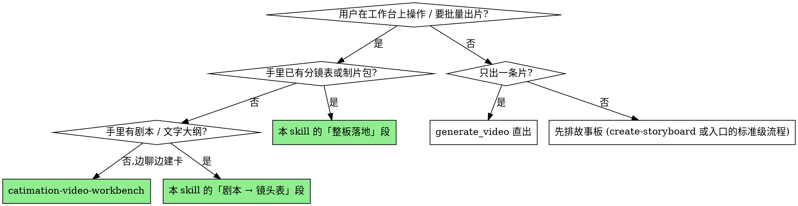

<!-- skill-budget: standard -->

# 视频工作台 · 整板出片

工作台是应用里的一块画布:一板卡片,每张卡是一次独立的 Seedance 调用。它和聊天里
的 `generate_video` 出的是同一种片子、受同一套纪律约束,区别只在**批量与可返工**——
卡片留在页面上,可以逐张改参数、重跑、比对版本。

本 skill 管**这块界面上的纪律与字段**。任务分级、素材 caps、QA 分档由
catimation-video 入口负责,写提示词由 `sd2-pe` 负责,单镜镜头设计由
`director-orchestrator` 负责 —— 本 skill 不重复它们,只在该交接的地方点名。

## When to Use

**vs. 直接 `generate_video`:** 一条片、用户没提工作台 —— 直出更快,不必建卡。
工作台的价值在于**多镜可比对、可逐张返工**;单镜用它反而多一次跳转。

**vs. 入口 catimation-video:** 入口决定「这活多大、要不要故事板、QA 到哪一档」;
本 skill 只在决定之后管「怎么落在这块板上」。**入口不会被本 skill 取代**,
分级仍然先发生。

## 一张卡 = 一次生成 = 一个镜头

这是本 skill 存在的首要理由,也是工作台独有的坑。

Seedance 一次调用只出一段(4–15s)。把「镜头1…镜头2…镜头3」写进同一张卡的提示词,
模型会试图把它们压进那一段里,**四个镜头一个都不成立** —— 不是质量差,是结构性失败。

N 个镜头就是 N 张卡,**卡片顺序即镜头顺序**。卡片本身没有 shot_id 字段,别把
S01/S02 塞进 prompt 里当结构。

## 跨卡纪律

每张卡都是**独立的一次调用**,卡与卡之间不共享上下文。所以:

- **人物锚点逐字复制进每一张卡的 prompt。** 不写就漂 —— 别指望模型跨卡记住。
  复用角色先在人像库锁 identity-hard 主锚,`asset://` 句柄整板复用。
- **风格/调色/光位描述同样要逐卡带。** 只在第一张卡写「赛博朋克夜景」,
  第五张就会变成别的片子。
- **会变化的道具与场景状态,每一镜都要写明它此刻的样子。** 椅子在这镜立着、下一镜
  翻倒在地 —— 并行渲染没有任何机制传递这个,只有把「椅子已翻倒在地」写进下一镜的
  prompt 才成立。人物锚点和风格是**不变量**逐卡复制;道具状态是**变量**逐卡交代。
  两者都不能省。
- **规格逐卡确认。** 卡片会自动补默认值(720p / 5s / 16:9),但**有默认值不等于
  用户确认过**。没确认就先问,别让默认值替用户决定。
- **同一角色的年龄/状态变体要另立一套锚点。** 「三年前的她」「受伤后的他」不是主锚
  加一句形容词能推出来的:另出一套 identity-hard 锚点单独入库,用到它的卡把**两套都
  带上**并写明关系(同一人,X 年前)。只带主锚,模型会当成现在的她;只带变体,跨镜就
  断成两个人。
- **画面里嵌画面(屏幕内容、照片、镜子与反射)时,里层是那一镜的主体。** 单独给它
  参考图,并在 prompt 里写明**它显示在什么东西上** —— 显示器、手机屏、相框、后视镜、
  水面、暗玻璃。不写载体,模型会把里层内容当成场景里真实存在的人或物;载体决定了它
  该有的画幅、眩光、衰减、清晰度和形变。

## 提问卡片:三张够了

一轮工作台任务可能有六件事要确认:方向、主锚、镜头表、规格、并行还是串行、音频。
一件一张卡逐个问,等于在渲染第一帧之前打断用户六次 —— 照章办事,却是糟糕的体验。

按这个配比合并:

1. **方向**(单独一张)—— 创作决定,值得单独想,3–6 个具体方向并标推荐。
2. **镜头表 + 跑法**(一张)—— 跑法(并行/串行)本来就是镜头表的属性,一起给。
3. **主锚 + 规格 + 音频**(一张)—— 参数互不影响,合起来更省事;主锚放这张是因为
   它通常只需要「就用这个 / 我另给」的确认。

**用户说「你帮我拿主意」时,那不是让你别问,是让你带着答案去问。** 每张卡都标出
推荐项并给一句理由,他点一下就过;但**不要把没有默认答案的创作决定替他定掉** ——
镜头数、影像方向、角色长相,这三样错了整板都要重来。

超过三张卡,先问自己是不是在用提问代替判断。

## 建卡:边聊边建

用户没有现成分镜时,用 `video_workbench_add_tasks` 逐张建。**默认只填不跑** ——
这不是限制,这正是补齐资产的窗口:建完卡再去锁锚点、排故事板、清点每镜素材,
齐了才 `video_workbench_start`。

提示词交 `sd2-pe` 工程化(八大要素、多模态绑定);镜头设计复杂时由入口在专业级
加载 `director-orchestrator`,本 skill 不代劳。

## 剧本 → 镜头表(用户给了本子但没有分镜)

**一句剧本 ≠ 一个镜头。** 剧本按叙事写,镜头按可拍摄单元切,两者数量没有对应关系。
拆的时候按这三条判,别数句子:

- **一句里出现两个信息层就拆开。** 一句同时交代「在哪儿」和「看见什么细节」时,
  一个镜头给不全 —— 广角建立镜交代空间,再一个近景交代细节。
- **一句里出现两个主体的两个动作就拆开**,尤其当第二个动作是情绪拐点时。压成一镜,
  拐点那一下会被前一个动作稀释掉,两个都不成立。
- **单一核心动作就是一镜**,不要为了凑数再切。一个连续动作(起身并走向门口)是一镜,
  不是两镜。

拆完先把镜头表给用户过目 —— 这就是「开跑前三项清点」第 2 条的故事板,不是额外一步。
用 `ask_user` 把你的拆法连同**镜头数选项**一起给他(例:就按 6 镜 / 压到 4 镜 / 扩到 8 镜),
并说明每种的代价。镜头数是创作决定,不该由你独自拍板。

镜头表定了就进下面的「整板落地」。

**什么时候该交出去而不是自己拆:** 用户要的是完整成片交付(含剧本打磨、配音、拼接、
正式交付版),那已经越过工作台的范围,按入口的分级表移交制片流程;需要逐镜连续性矩阵、
handoff 表这类导演级制片包时,走 create-storyboard 出包再回到「整板落地」。
本节只覆盖「本子已经够用,只差把它切成镜头」这一段。

## 整板落地:已有分镜 / 制片包

用户手里已有 shot list、分镜表或 create-storyboard 制片包时,走整板通道:

`video_workbench_export` 拿当前 IR → 按下表填好整个数组 → `video_workbench_apply`
一次写回。数组顺序即卡片顺序。保持 `irVersion` / `structureRevision` / 每张卡的
`rev` 不变,否则会被拒。

镜头少(≤5)时直接逐张 `video_workbench_add_tasks` 更省事。

### Shot Card → 卡片字段

| Shot Card 字段 | 卡片字段 | 说明 |
| --- | --- | --- |
| `scenedance_prompt` | `prompt` | 正文直接搬;分段结构先按 sd2-pe 连成可提交的成文 |
| `duration` | `duration` | 收敛到 4–15;`-1` 表示智能时长 |
| `primary_input_image` | `referenceImages[0]` | 首图放第一位 —— 它承担构图/画质锚点 |
| `reference_images` | `referenceImages` | 合计 ≤9 张 |
| `shot_size` / `camera_movement` | 并入 `prompt` | 卡片无独立字段,写进运镜段 |
| `shot_id` | 卡片顺序 | 靠排列顺序表达,不进 prompt |
| `prev_transition` / `next_transition` | 不映射 | 转场属后期剪辑,不是单镜输入 |

Shot Card 里没有、需要你决定的:`model`(默认 `2.0`)、`resolution`(默认 `720p`)、
`ratio`(默认 `16:9`)、`mode`(默认全能参考)、`generateAudio`(默认开)。

## 跨镜续接:批量与串行的取舍

入口有一条「跨镜续接优先抽上一镜关键帧/尾帧作下一镜 `firstFrame`」。那条默认针对
**逐镜串行推进**,和工作台的批量并行天然互斥 —— 第 2 镜的首帧要等第 1 镜渲完才存在。
两条纪律都对,只是不能同时用。

- **工作台默认走可并行那条:** 全能参考 + 逐卡逐字复制的身份/风格锚点。填满整板一次
  `video_workbench_start`,几镜同时跑。绝大多数场景够用 —— 锚点写足了,跨镜一致性
  靠文字也能守住。
- **需要帧级硬续接时改串行:** 镜与镜要求画面严丝合缝(同一动作跨镜延续、不许跳切)时,
  一次只 start 一张卡 → 等推送 → 用 ffmpeg-win 抽尾帧 → 填进下一张卡的 `firstFrame`
  → 再 start。慢,但这是唯一能做到帧级续接的路径。
  入口另有一条「`firstFrame`/`lastFrame` 只在用户明确要求时才切」—— 把下面这个取舍
  摆给用户、他选了串行,就构成那条所说的「明确要求」,不必再确认第二次。
- **别把两者混着来。** 整板并行跑完之后再去抽尾帧回填,已经渲好的卡不会因此重跑;
  你拿到的是几段各自独立的片子,外加一次白费的抽帧。要串行就从一开始串行。

选哪条要**告诉用户**并说明代价(并行快但转场可能硬,串行慢但接得住),别默默替他定。

## 配乐与音频

卡片上的 `generateAudio`(默认开)出的是**该镜自己的**对白 / 环境声 / 音效,由 Seedance
随画面一起生成。它不是配乐,也**不可能跨卡连续** —— 每张卡是一次独立调用,几段音乐接
不成一条曲线。

要一条铺满全片的配乐,交 `catimation-audio` 出整段,成片后用 ffmpeg-win 把各镜 concat
起来再把音乐混进去。

**别把配乐当参考音频喂进卡片:** `referenceAudios` 合计 ≤15s,多镜成片通常超过这个长度
(4 镜 × 5s = 20s 就塞不下);而且参考音频作用于该镜的生成,不是给成片配乐用的。

多镜且要统一配乐时,`generateAudio` 开还是关取决于要不要保留逐镜环境声 —— 保留就开
(音乐后期叠在上层),要干净画面轨就关。这个取舍讲给用户,别替他决定。

## 开跑前的三项清点

入口的「角色片/多镜」硬门在工作台上一字不改地适用。**建卡不等于备齐资产**,
`video_workbench_start` 之前这三样必须已完成:

1. **每个复用角色已锁 identity-hard 主锚**,并逐字写进每张卡的 prompt。
2. **故事板已给用户过目。** 没点头就开跑,等于替他决定了镜头设计。
3. **逐镜资产齐备。** 缺口按「先找人像库现成 → 非身份关键的自己 generate_image 补
   → 身份/IP/品牌关键的才问用户」处理。推荐每镜 4–5 个核心素材;有素材却纯文字=错。

## 开跑之后

**不要轮询 `video_workbench_status`。** 批次跑完会主动推「[视频工作台] 批次渲染完成」
摘要给你。提交后立刻回答用户,保持可对话。

摘要只报成败与落盘路径,**不代表 QA 已做**。人脸/复杂动作的卡照样抽九宫格,
多镜剧情照样过内容 QA,做过的档记进 `qa_completed`。

**重试有两道闸,别只记住第一道。** 单卡受入口的 `generation_attempts ≤2` 约束:
同一张卡连续失败两次还不对,先回去查锚点和素材,不要第三次重投。整板另有一道:
**一轮跑完需要重做的卡超过半数时,停下来找共因,不要逐张重投** —— 半数以上一起出
问题,病根通常在锚点、素材或规格这些整板共用的东西上,逐张重跑等于把同一个错误付费
N 次。找到共因、改一次、整板重来,比每张卡各试两次便宜得多,也快得多。无论哪道闸
触发,先把成本和判断讲给用户,由他决定要不要继续。

## Common Mistakes

- **把多镜写进一张卡。** 最常见、也最贵 —— 整张卡的算力全废。
- **只在第一张卡写锚点。** 后面的卡会漂脸、漂服装、漂风格。
- **建完卡直接 start。** 跳过了资产门,而「只填不跑」的默认设计就是为了让你补齐。
- **轮询状态。** 阻塞自己,还拿不到比推送更早的结果。
- **拿批次摘要当 QA。** 它只说渲染成功,没说画面对。
